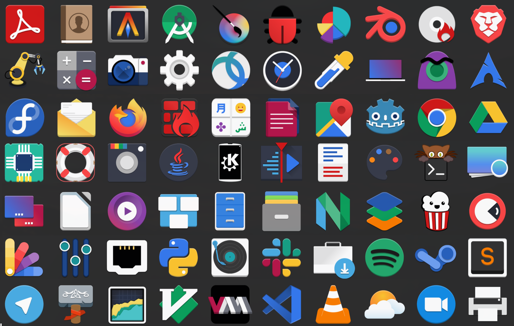
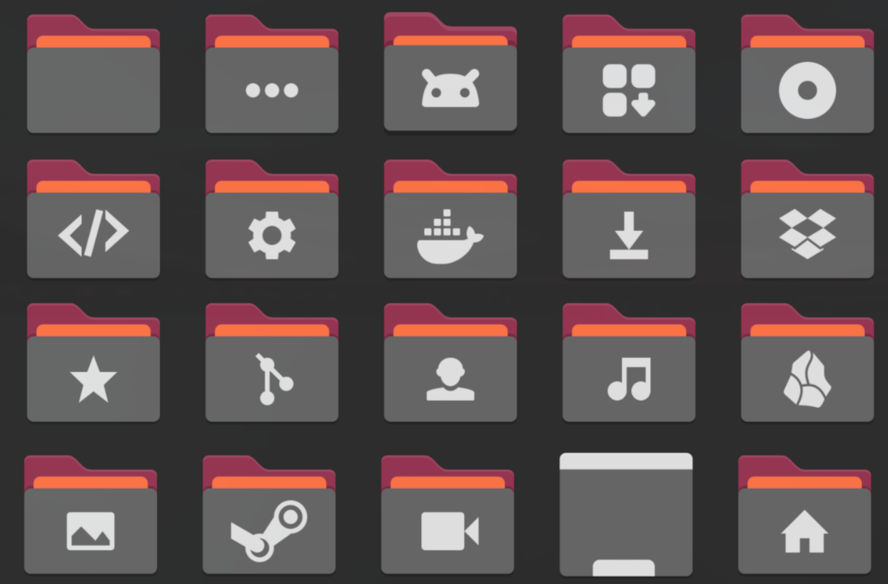

# Yaru+FlatRemix+Plus Icon Theme

A custom icon theme mixing Yaru (Ubuntu), Flat Remix, and Oranchelo Becka icons. Designed for personal use, but shared for others who may find it useful.

## About

This icon theme combines icons from three popular projects:

- **Yaru** (Ubuntu's default icon theme) - provides clean, modern icons
- **Flat Remix** - offers flat design with colorful palette and subtle shadows
- **Oranchelo Becka** - adds flat icons with long shadow effects

The theme is designed to work with GNOME, Unity, and other desktop environments that support the FreeDesktop icon theme specification.

## Preview Application Icons



## Preview Folders Icons



## Installation

1. Extract the theme to your icons directory:
   ```bash
   mkdir -p ~/.local/share/icons
   cp -r Yaru+FlatRemix+Plus ~/.local/share/icons/
   ```

2. Alternatively, install system-wide (requires sudo):
   ```bash
   sudo cp -r Yaru+FlatRemix+Plus /usr/share/icons/
   ```

3. Select the theme using your desktop environment's appearance settings:
   - GNOME: Use GNOME Tweaks or Settings > Appearance
   - Unity: Use Unity Tweak Tool
   - Other: Use appropriate theme switcher

4. Refresh the icon cache:
   ```bash
   gtk-update-icon-cache -f ~/.local/share/icons/Yaru+FlatRemix+Plus
   ```
   For system-wide installation:
   ```bash
   sudo gtk-update-icon-cache -f /usr/share/icons/Yaru+FlatRemix+Plus
   ```

## Credits and Attribution

This theme is a derivative work combining icons from multiple sources. Proper attribution is required by their respective licenses.

### Yaru Icons
- **Source**: https://github.com/ubuntu/yaru
- **Copyright holders**: See `ATTRIBUTION_Yaru` file for complete list
- **License**: Creative Commons Attribution-ShareAlike 4.0 International (CC BY-SA 4.0)
- **License file**: `LICENSE_Yaru_CCBYSA`

### Flat Remix Icons
- **Source**: https://github.com/daniruiz/flat-remix
- **Maintainer**: Daniel Ruiz de Alegría (https://drasite.com)
- **Based on**: Paper, EvoPop, Numix, Flattr, and Papirus icon themes (see `ATTRIBUTION_FlatRemix` for details)
- **License**: GNU General Public License v3.0 (GPL-3.0)
- **License file**: `LICENSE.txt`

### Oranchelo Becka Icons
- **Designer**: Adolfo Silerio (zayronxio) - https://www.deviantart.com/zayronxio
- **Based on**: superflat-remix
- **Assumed license**: GNU General Public License v3.0 (GPL-3.0) due to derivation from Flat Remix family
- **License file**: `LICENSE.txt`

### Additional Credits
- Some icons are extracted from the pack "Plateau" by sbstnblnd
- Firefox icon replica from "retrorika" icon pack for Android by sikebo
- Inspired by "icons Cornie beta" by Patryk Goworowski

## License

This icon theme compilation is provided under the terms of the GNU General Public License v3.0 (GPL-3.0) as the overall license for the collection.

However, note that individual icons retain their original licenses:
- Yaru icons: CC BY-SA 4.0
- Flat Remix icons: GPL-3.0
- Oranchelo Becka icons: Assumed GPL-3.0

When distributing this theme, you must comply with all applicable licenses:
- For GPL-3.0 components: Provide source code and license text
- For CC BY-SA 4.0 components: Provide attribution and share-alike terms

The complete license texts are included in the `LICENSE.txt` (GPL-3.0) and `LICENSE_Yaru_CCBYSA` (CC BY-SA 4.0) files.

## Contributing

This is a personal project shared for convenience. While contributions are welcome, please note that this is a derivative work and any modifications should respect the original licenses.

If you want to improve the theme:
1. Fork the repository
2. Make your changes
3. Submit a pull request

## Disclaimer

This theme is provided "as is" without warranty of any kind. The maintainer is not responsible for any issues arising from its use.

All trademarks and copyrights are property of their respective owners.
